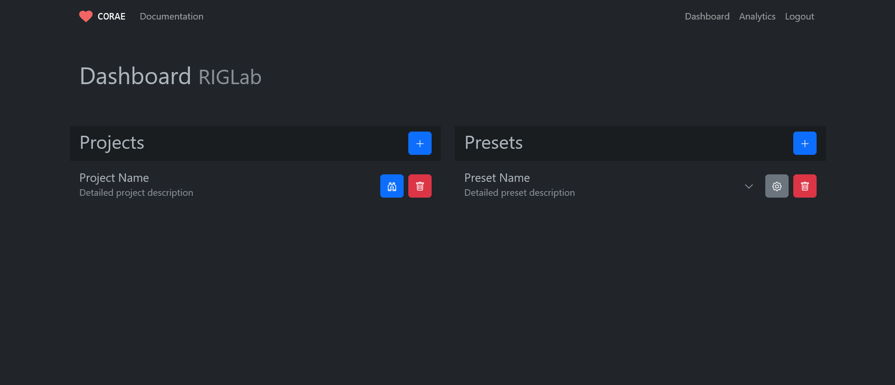
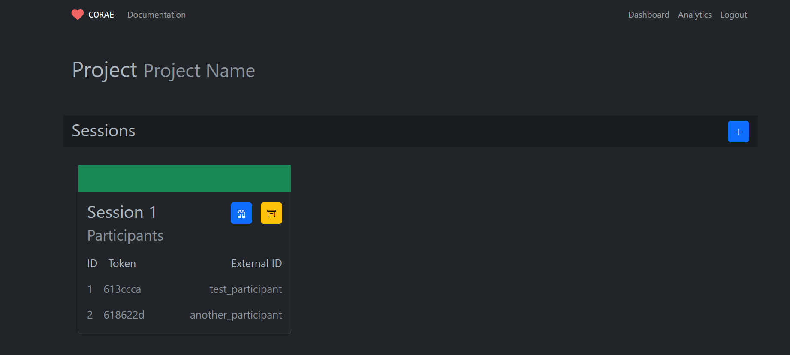
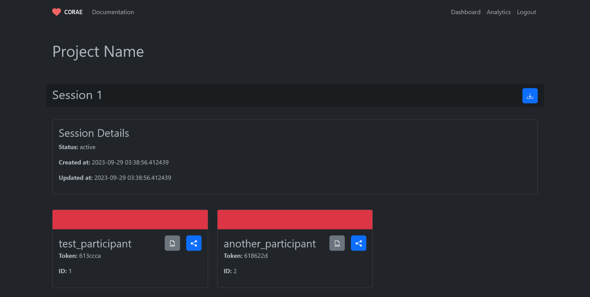

# **CORAE** - **Co**ntinuous **R**etrospective **A**ffect **E**valuator

[](LICENSE)


## Description

[CORAE](https://www.corae.org/) is a web-based tool to support the collection of continuous affect data.

## Table of Contents

- [Prerequisites](prerequisites)
- [Installation](#installation)
  - [Windows](#automatic-installation-on-windows)
  - [Linux](#automatic-installation-on-linux)
- [Usage](#usage)
  - [Dashboard](dashboard)
    - [Windows](launching-on-windows)
    - [Linux](launching-on-linux)
  - [Annotator](#)
- [Configuration](#configuration)
  - [Annotation Settings](#annotation-settings)
- [Views](#views)
- [License](#license)
- [Credits](#credits)

## Prerequisites

### [git](https://git-scm.com/download/)

### [Python3](https://www.python.org/downloads)

### [FFmpeg](https://ffmpeg.org/download.html)

## Installation

### Automatic Installation on Windows

> **Note**
> When installing Python, ensure to add it to your system's environment variables.
> There is a setting within the Python installer to perform this task automatically.

1. Install [git](https://git-scm.com/download/win).

2. Install [Python3](https://www.python.org/downloads).

3. Install [FFmpeg](https://ffmpeg.org/download.html).

4. Navigate to the directory that you would like `CORAE` to be downloaded.

5. Download the `CORAE` web repository.

```bash
$ git clone https://www.github.com/mjsack/CORAE.git
```

5. Run `build_windows.bat` via Windows Explorer, or using the following command:

```bash
$ .\build_windows.bat
```

### Automatic Installation on Linux

1. Install `Python3`.

```bash
$ sudo apt install wget git python3 python3-venv
```

2. Install `FFmpeg`.

```bash
$ sudo apt install ffmpeg
```

2. Navigate to the directory that you would like `CORAE` to be downloaded.

3. Download the `CORAE` web repository.

```bash
$ git clone https://www.github.com/mjsack/CORAE.git
```

4. Run `build_linux.sh`.

```bash
$ bash build_linux.sh
```

## Usage

### Launching the Dashboard

#### On Windows

1. Navigate to your install directory.

2. Run `launch.bat` via Windows Explorer, or using the following command:

```bash
$ .\launch.bat
```

3. Access the app on your local machine by visiting http://localhost:5000 in your web browser.

#### On Linux

1. Navigate to your install directory.

2. Run `launch.sh` using the following command:

```bash
$ bash launch.sh
```

3. Access the app on your local machine by visiting http://localhost:5000 in your web browser.

## Configuration

We developed `CORAE` to be an accessible, intuitive, and highly customizable tool for capturing continuous affect data from participants through media annotation.

### Host

Depending on the needs of your project, there are many solutions for making your deployment publicly accessible. For smaller-scale adhoc sessions, tunneling services such as `ngrok` may suffice.

Crucially, unless manually changed, CORAE is served on port `5000`.

### Annotator Settings

Below are the descriptions for settings available for configuration in `CORAE`. Some of the settings below are displayed conditionally, such that their value is assigned to a default state unless specific conditions are met.

#### Annotation Method

Determines how participants input their annotations.

- `CORAE`: This is the standard method for annotation that enables annotation along a single linear dimension.

#### Session Capacity

Determines how many participants each session will accomodate.

#### Video Coupling

Determines how videos are associated with participants.

- `Coupled` assigns each participant as the 'owner' of a specific video during session creation. Participants will annotate each other video in the session except for that which they are 'owner' of.
- `Decoupled` associates each participant with each video without establishing any 'owner' relationships. Each participant will annotate each video in the session without exception.

#### Video Ordering

Determines the order in which participants will be presented videos for annotation during their session.

- `Random` presents each participant videos for annotation in a pseudo-random order.
- `Ordered` presents each participant videos for annotation in a predetermined order.

#### Bounding

Determines whether or not ratings with the annotation slider are numerically bound.

- `Bounded` restricts the annotation slider to a predetermined range of values the cannot be exceeded.
- `Unbounded` restricts input for the annotation slider to either 'positive' or 'negative' adjustments, but is numerically unrestricted.

#### Granularity

Determines the number of values on the annotation scale, excluding the neutral point of zero. This setting can be assigned any even-numbered integer value. This setting is only modifyable if `Bounding` is set to `Bounded`.

#### Primary Axis

Determines the label for the scale axis indicating to participants the affective dimension they should evaluate during their session. This setting can be assigned any string of characters. Particularly lengthy axis labels may wrap to the next line to avoid overlap with the `Ceiling` and `Floor` labels.

#### Ceiling

Determines the label for the right-most, or positive, value of the scale axis. This setting can be assigned any string of characters. Particularly lengthy `Ceiling` labels may wrap to the next line to avoid overlap with the `Primary Axis` label.

#### Floor

Determines the label for the left-most, or negative, value of the scale axis. This setting can be assigned any string of characters. Particularly lengthy `Floor` labels may wrap to the next line to avoid overlap with the `Primary Axis` label.

## Views

### Admin Dashboard

The `Admin Dashboard` acts as the landing page for research management. From this page, you may create new `Projects` and `Presets`, view details for and delete each of them as desired. To prevent accidental deletions, there is a protection in place that requires two successive clicks on the delete button.



### View Project

The `View Project` page displays details pertaining to all sessions in a project, namely, project status, and a list of participants associated with each session.



### View Session

The `View Session` page allows for the review of details pertaining to a specific project session, including the progress of each participant across the session. The colored bar above each participant card is indicitive of their status. `Red` indicates that they have yet to join their session, `Yellow` indicates that they have joined their session and are currently performing annotations, and `Green` indicates that they have submitted their annotations.



## License

Copyright (c) 2021-2023 Cornell University

Permission is hereby granted, free of charge, to any person obtaining a copy of this software and associated documentation files (the "Software"), to deal in the Software without restriction, including without limitation the rights to use, copy, modify, merge, publish, distribute, sublicense, and/or sell copies of the Software, and to permit persons to whom the Software is
furnished to do so, subject to the following conditions:

The above copyright notice and this permission notice shall be included in all copies or substantial portions of the Software.

THE SOFTWARE IS PROVIDED "AS IS", WITHOUT WARRANTY OF ANY KIND, EXPRESS OR IMPLIED, INCLUDING BUT NOT LIMITED TO THE WARRANTIES OF MERCHANTABILITY, FITNESS FOR A PARTICULAR PURPOSE AND NONINFRINGEMENT. IN NO EVENT SHALL THE AUTHORS OR COPYRIGHT HOLDERS BE LIABLE FOR ANY CLAIM, DAMAGES OR OTHER LIABILITY, WHETHER IN AN ACTION OF CONTRACT, TORT OR OTHERWISE, ARISING FROM, OUT OF OR IN CONNECTION WITH THE SOFTWARE OR THE USE OR OTHER DEALINGS IN THE SOFTWARE.
